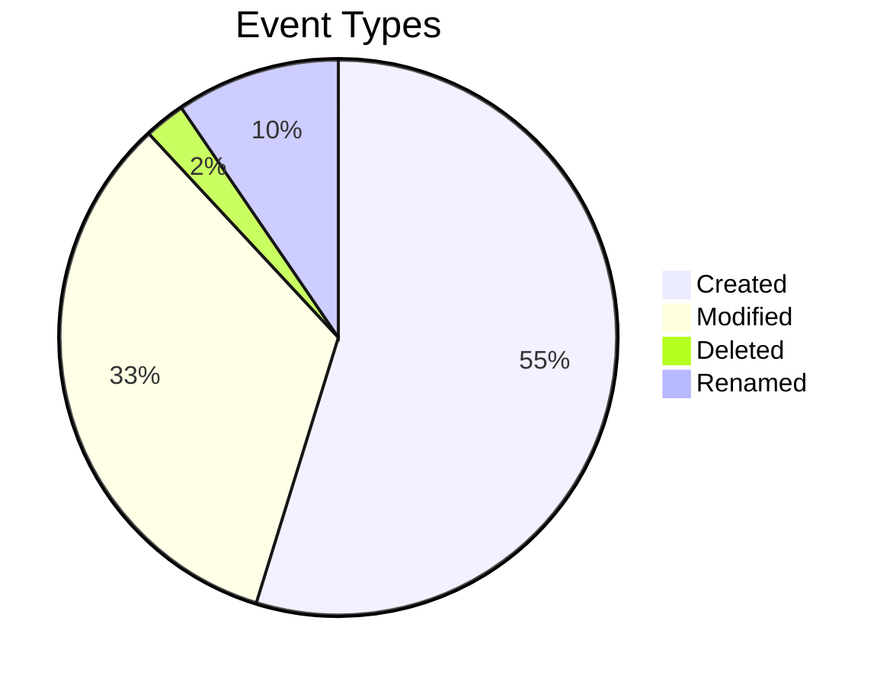

# 📊 Activity Dashboard

*Generated on 4/11/2025 at 2:34:27 PM*

> [!button] Refresh Dashboard
> ```command
> daily-activity: Refresh dashboard
> ```

This dashboard provides visualizations and insights from your Obsidian activity data. Advanced charts are rendered using the Charts plugin.

> [!NOTE]
> This dashboard is automatically generated by the Daily Activity plugin. Manual edits will be overwritten when the dashboard is updated.

> [!info] Activity Tracking Notice
> This dashboard is excluded from activity tracking. Any changes you make to this file will not affect your activity metrics.

---

# Activity Summary (Last 30 Days)

## Key Metrics

- **Total Events:** 42
- **Unique Files:** 14
- **Lines Added:** 16587
- **Lines Removed:** 464
- **Net Change:** 16123 lines

## Event Breakdown



## Activity Snapshot

| Metric | Value |
|--------|-------|
| Most Active Day | Friday |
| Most Active Hour | 11:00-12:00 |
| Most Edited File | [[Activity Dashboard]] (1 edits) |
| Average Daily Events | 1 |
| Average Edits Per File | 1 |

---

# Top Files Analysis

## Top 10 Most Edited Files

| File | Edits | Lines Added | Lines Removed |
|------|-------|-------------|---------------|
| [[Activity Dashboard]] | 1 | 6227 | 0 |
| [[Adding a new file on Friday morning befor enoon]] | undefined | 0 | 0 |
| [[Adding a new file on Friday morning before noon]] | undefined | 0 | 0 |
| [[Creating a new page]] | undefined | 414 | 0 |
| [[Here's a new file]] | undefined | 16 | 0 |
| [[Here's a new page after adding more logging]] | undefined | 376 | 0 |
| [[New file here. Does it get logged to created]] | undefined | 57 | 0 |
| [[New page]] | undefined | 142 | 0 |
| [[README]] | undefined | 1966 | 0 |
| [[Test page]] | undefined | 266 | 0 |


## Top Files by Edit Count

```chart
type: bar
labels: ["Activity Dashbo", "Adding a new fi", "Adding a new fi", "Creating a new ", "Here's a new fi"]
series:
  - title: Edits
    data: [1, , , , ]
tension: 0.2
width: 80%
labelColors: true
beginAtZero: true
```


---

# Time Distribution

## Activity by Day of Week

```chart
type: bar
labels: ["Sun", "Mon", "Tue", "Wed", "Thu", "Fri", "Sat"]
series:
  - title: Events
    data: [0, 0, 0, 0, 0, 42, 0]
width: 80%
labelColors: true
beginAtZero: true
```

## Activity by Hour of Day

```chart
type: bar
labels: ["00:00", "02:00", "04:00", "06:00", "08:00", "10:00", "12:00", "14:00", "16:00", "18:00", "20:00", "22:00"]
series:
  - title: Events
    data: [8, 14, 0, 0, 0, 20, 0, 0, 0, 0, 0, 0]
width: 80%
labelColors: true
beginAtZero: true
```

## Insights

You are primarily active on weekdays, especially on Fridays

You are most active during the night (12AM-5AM) and least active during the evening (6PM-12AM)

---

# Activity Heatmap

```chart
type: polarArea
labels: ["Morning", "Afternoon", "Evening", "Night"]
series:
  - title: Sun
    data: [0, 0, 0, 0]
  - title: Mon
    data: [0, 0, 0, 0]
  - title: Tue
    data: [0, 0, 0, 0]
  - title: Wed
    data: [0, 0, 0, 0]
  - title: Thu
    data: [0, 0, 0, 0]
  - title: Fri
    data: [20, 0, 0, 22]
  - title: Sat
    data: [0, 0, 0, 0]
width: 70%
labelColors: true
```

### Activity by Time of Day

| Day | Morning (5-11) | Afternoon (12-17) | Evening (18-23) | Night (0-4) | Total |
|-----|---------------|------------------|----------------|------------|-------|
| Sunday | 0 | 0 | 0 | 0 | 0 |
| Monday | 0 | 0 | 0 | 0 | 0 |
| Tuesday | 0 | 0 | 0 | 0 | 0 |
| Wednesday | 0 | 0 | 0 | 0 | 0 |
| Thursday | 0 | 0 | 0 | 0 | 0 |
| Friday | 20 | 0 | 0 | 22 | 42 |
| Saturday | 0 | 0 | 0 | 0 | 0 |


---

# Activity Trends

## Activity Over Time

```chart
type: line
labels: ["03-13", "03-16", "03-19", "03-22", "03-25", "03-28", "03-31", "04-03", "04-06", "04-09"]
series:
  - title: Total
    data: [0, 0, 0, 0, 0, 0, 0, 0, 0, 42]
  - title: Created
    data: [0, 0, 0, 0, 0, 0, 0, 0, 0, 23]
  - title: Modified
    data: [0, 0, 0, 0, 0, 0, 0, 0, 0, 14]
tension: 0.2
width: 90%
fill: false
beginAtZero: true
```

## Event Type Distribution

```chart
type: pie
labels: ["Created", "Modified", "Deleted", "Renamed"]
series:
  - data: [23, 14, 1, 4]
width: 60%
labelColors: true
```

## Trend Analysis

- **Activity Trend:** Your activity has remained relatively stable over the last month
- **Peak Activity:** Your most active day was 2025-04-11 with 42 events
- **Consistency:** Your activity pattern shows some gaps or inconsistency

---

# Writing Patterns

## Content Changes

```chart
type: pie
labels: ["Small Edits (<10 lines)", "Medium Edits (10-49 lines)", "Large Edits (50+ lines)"]
series:
  - data: [3, 2, 6]
width: 60%
labelColors: true
```

```chart
type: bar
labels: ["Lines Added", "Lines Removed"]
series:
  - data: [2518, 0]
width: 50%
labelColors: true
beginAtZero: true
```

## Writing Style Analysis

- **Bulk Writer:** You often write large chunks of content at once, with significant additions.
- **Additive Writer:** You primarily add new content with minimal deletion of existing text.
- **Focused Sessions:** You tend to edit in less frequent but possibly more concentrated sessions.


